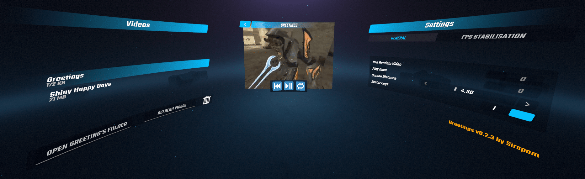

# Greetings 
Beat Saber mod for playing a video on the game's start up
## Usage
Greeting's Settings can be accessed from the Mods panel.

To change the video played by Greetings, add an MP4 file to UserData/Greetings. From here the video should be selectable from in game.
## Installation
[Install](https://bsmg.wiki/pc-modding.html#install-mods) the latest version of [Greetings](https://github.com/Sirspam/Greetings/releases/latest) and the dependencies listed below.
### Dependencies
* [SiraUtil](https://github.com/Auros/SiraUtil) _- Available in ModAssistant_
* [BeatSaberMarkupLanguage](https://github.com/monkeymanboy/BeatSaberMarkupLanguage) _- Available in ModAssistant_
## Contribution
Feel free to point out any suggestions or improvements by submitting a PR or contacting me on Discord ([Sirspam#7765](https://discordapp.com/users/232574143818760192)).
